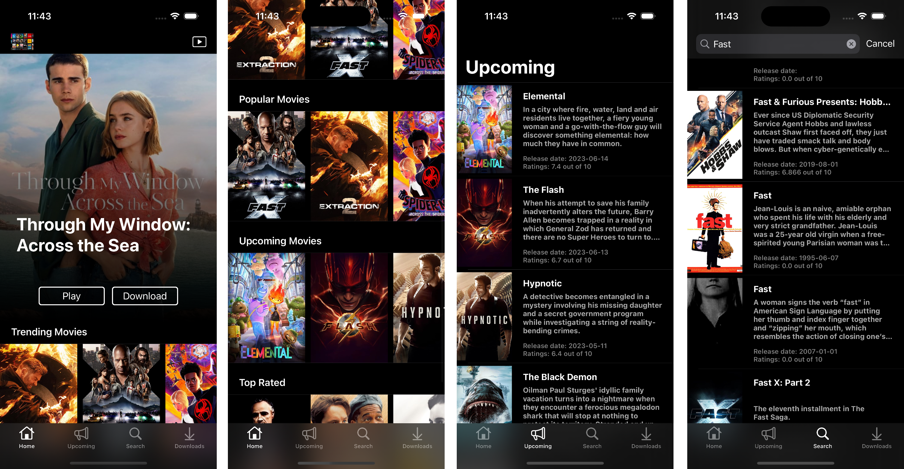

# Labflix
Labflix is a movie streaming app using tmdb and youtube api.
This app is build to demonstrate programmatic UIKit, Combine and CoreData.
This project is opensource and can be used in any way possible.
Feel free to clone, reuse and improve codebase.

## Features
- Homescreen displays trending, popular, upcoming and top rated movies.
- Upcoming tab displays a table of upcoming movies.
- Search tab where user can search for movies.
- Downloads tab displays the movies downloaded by the user.
- User will be able to tap on a movie to go to details screen.
- User will be able to play movies.
- User will be able download movies.
- User will be able remove a movie from the downloads tab.

## Technology
- UIKit
- Combine
- CoreData
- TMDB API
- Youtube API
- XCTest

## Architecture
This project is build with MVVM architecture.

## Screenshots

